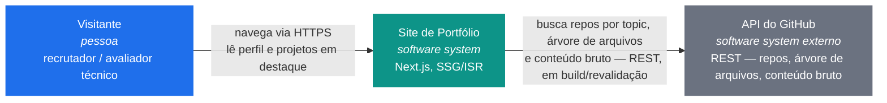

# Arquitetura — System Context (C4, nível 1)

O site é uma aplicação única: não há banco de dados, fila, worker ou serviço adicional
próprio. A única dependência externa é a API REST pública do GitHub, de onde o site lê
os dados de perfil de projetos e o conteúdo dos repositórios em tempo de build/revalidação
(SSG/ISR) — nunca a partir do navegador do visitante.

Por isso este diagrama para no nível 1 (Context). Um nível 2 (Container) não agregaria
informação nova: o "container" aqui seria só "a aplicação Next.js", idêntico à caixa
central deste diagrama.

## Legenda

| Elemento | Significado |
| --- | --- |
| 🔵 Pessoa | Quem usa o sistema — o visitante do site (recrutador, avaliador técnico). |
| 🟢 Software System (interno) | O sistema documentado aqui — o site de portfólio. |
| ⚪ Software System (externo) | Sistema de terceiros com o qual o site conversa, mas que não é operado por este projeto. |
| Rótulos nas setas | Descrevem o protocolo e a intenção da comunicação, não só a direção. |

## Notas

- A comunicação `Site → GitHub API` acontece **no servidor**, durante o build ou uma
  revalidação de ISR (`revalidate: 3600`) — não a cada requisição de um visitante. Isso
  mantém o número de chamadas à API do GitHub baixo mesmo com muitos visitantes
  simultâneos (ver [ADR 001](../decisions/001-fonte-e-atualizacao-de-dados-dos-projetos.md)).
- Não existe autenticação de usuário nem escrita de dados em nenhuma direção — todo o
  fluxo é leitura.
